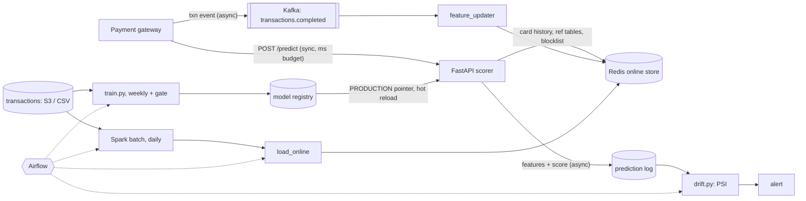

# Real-time fraud detection: training to production

An end-to-end ML system: point-in-time feature engineering, gated training with a model
registry, a low-latency scoring API backed by an online feature store, batch (Spark) and
streaming (Kafka) pipelines, drift monitoring, Airflow orchestration, Docker, and CI.

## Architecture



**Hot path:** validate → one Redis read → `compute_features` (the *same function* training
uses) → XGBoost → tier → guardrails → respond. The log write happens after the response.

## Quickstart (local, no Docker)

You need Python 3.10+, Redis (`brew install redis` / `apt install redis-server`), and Java 17
for Spark.

```bash
pip install -r requirements-dev.txt
make data        # 268k synthetic transactions, ~0.3% fraud
make train       # walk-forward eval, thresholds, gate, registry
make test        # 19 tests, including training/serving parity and Spark parity
redis-server --daemonize yes
make spark load  # batch reference tables + 30-day history backfill into Redis
make serve       # terminal 2: API on :8000
make replay      # replay the held-out week through the live API
make drift       # PSI report on what was served
make drift-demo  # shift traffic and watch drift fire
make load-test
```

Full stack with Kafka: `make up`, then the `make load` step, then `make replay-kafka`.
AWS: see [deploy/AWS.md](deploy/AWS.md).

```bash
curl -X POST localhost:8000/predict -H 'content-type: application/json' -d \
 '{"txn_id":"t1","card_id":"c00042","amount":850,"merchant_category":"electronics","location":"city_37","ts":1771900000}'
```

## Repo map

| Path | What it does |
|---|---|
| `src/fraud/features.py` | The only feature definition. Point-in-time target encoding with label delay |
| `src/fraud/train.py` | Walk-forward validation, F2 / precision-floor thresholds, champion/challenger gate, registry, drift baselines |
| `src/fraud/api.py` | Scoring service: metrics, degraded mode, prediction log, `/admin/reload` |
| `src/fraud/feature_store.py` | Redis sorted-set history (idempotent writes), cached reference tables |
| `src/fraud/rules.py` | Guardrails. Post-model rules can only make a decision stricter |
| `src/fraud/drift.py` | PSI on numeric features, category mix and scores; exit 1 on ALERT |
| `batch/spark_reference_features.py` | Daily PySpark job (same formula as training) |
| `streaming/` | Gateway simulator (Kafka producer) and feature updater (consumer) |
| `airflow/dags/` | Daily batch → load → drift; weekly retrain → gate → reload |
| `monitoring/` | Prometheus scrape config and alert rules |

## Results (synthetic data, 1 vCPU)

| Metric | Value |
|---|---|
| Walk-forward PR-AUC | 0.77, 0.83, 0.83, 0.84 |
| Test week PR-AUC / ROC-AUC | 0.80 / 0.98 |
| At STEP_UP threshold | recall 0.73, precision 0.83 |
| Precision at DECLINE | 0.94 |
| Online replay through deployed API | recall 0.727, precision 0.828 (matches offline exactly) |
| Latency, sequential | p50 2.4 ms, p99 3.7 ms |
| Redis down | serves in about 1.6 ms, degraded, larger amounts stepped up |
